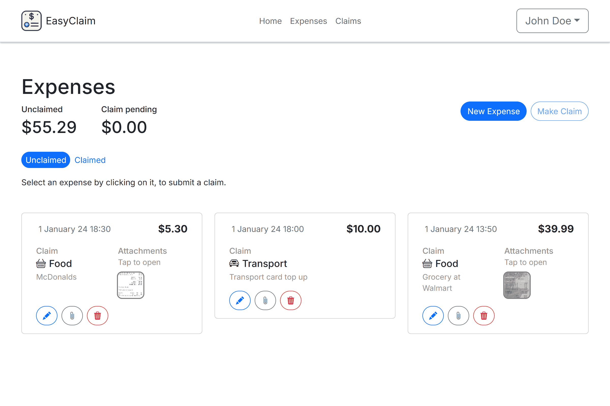
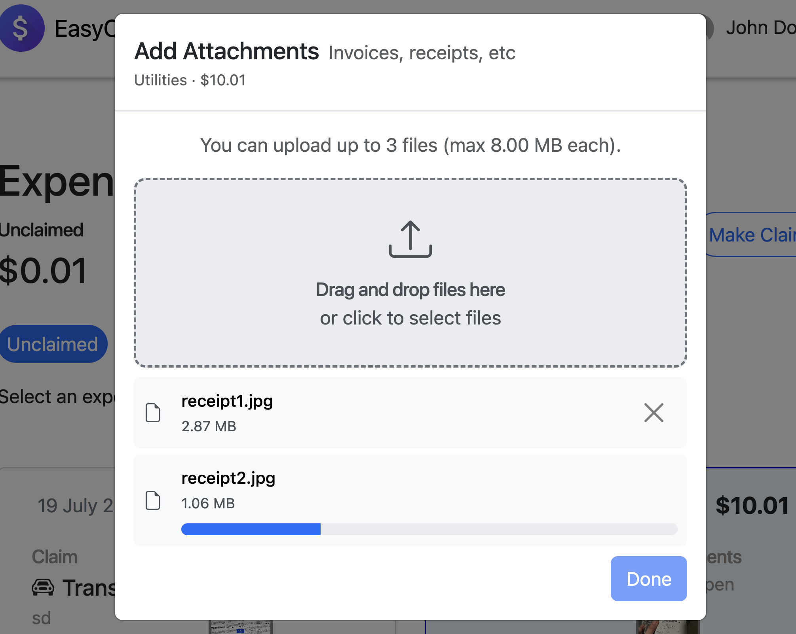
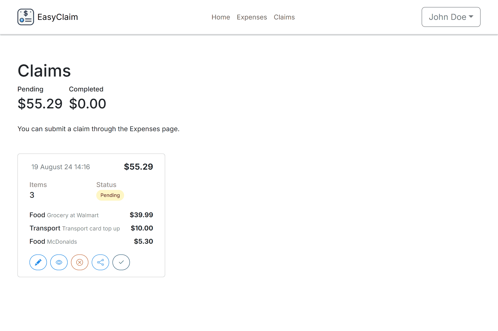
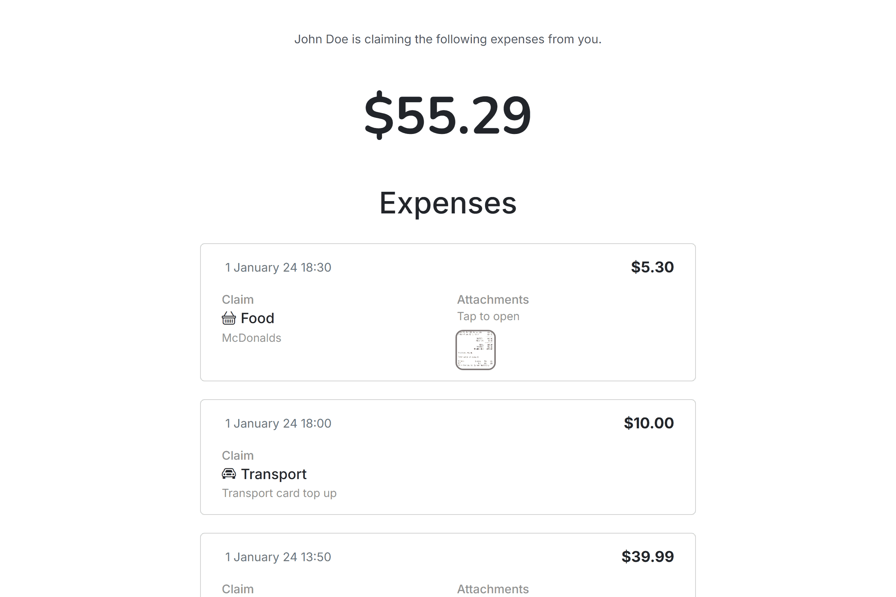
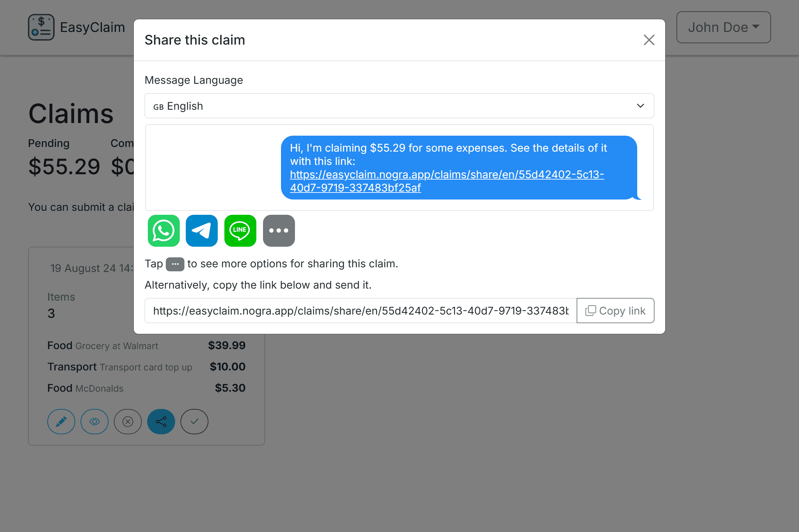

<div id="top">

<!-- HEADER STYLE: CLASSIC -->
<div align="center">


# EasyClaim

<em></em>

<!-- BADGES -->


</div>
<br>

<div align="center">

</div>
<br>

---

## Table of Contents

- [Table of Contents](#table-of-contents)
- [Overview](#overview)
- [Features](#features)
- [Project Structure](#project-structure)
    - [Project Index](#project-index)
- [Getting Started](#getting-started)
    - [Prerequisites](#prerequisites)
    - [Installation](#installation)
    - [Usage](#usage)
    - [Testing](#testing)
- [Roadmap](#roadmap)
- [Contributing](#contributing)
- [License](#license)
- [Acknowledgments](#acknowledgments)

---

## Overview

EasyClaim is a TypeScript-based expense tracking application designed to help users manage their finances through the logging of expenses and generating shareable claims. It features a user-friendly interface, quick expense entry, and the ability to attach receipts or notes to each expense.

---

## Features

- **Quick Expense Entries**  
    
  Expenses can be added with just a few taps, making it extremely easy and convenient to add one.

- **Attachments For Your Expenses**  
    
  A receipt or any attachment can be added to your expenses - through an intuitive UI - to ensure you have a proof of purchase, or simply for your peace of mind.

- **Clear and Simple Summaries**  
    
  See where your money goes with information about your expenses clearly displayed with EasyClaim, perfect for budgeting or keeping an eye on your spending habits.

- **Create Compiled Claims**  
    
  Create a claim with all your expenses in one place, making it easy to share with friends or family.

- **Shareable Claims**  
    
  Likewise, claims shared to your friends or family are extremely easy to understand.

## Screenshots



---

## Project Structure

```sh
├── package.json                # Project metadata + dependencies
├── prisma                      # Prisma ORM files
│   ├── migrations              # Database migration files part of versioning
├── src                         # Source code for EasyClaim
│   ├── app.ts                  # Main application entry point
│   ├── bin                     # Executable scripts (server start is here)
│   ├── config                  # Configuration files for EasyClaim and certain services
│   ├── controllers              # Route request handlers
│   ├── middlewares              # Middleware functions for request processing
│   ├── public                   # Public assets for the frontend website
│   │   ├── assets               # Static assets (images, scripts, styles)
│   │   ├── manifest.json        # For PWA support
│   ├── routes                   # Endpoint route definitions for the application
│   ├── services                 # Business logic and service layer
│   ├── types.ts                 # Type definitions for TypeScript
│   ├── utils                    # Utility functions for various tasks
│   └── views                    # View templates for rendering pages
│       ├── components            # Reusable view components
│       └── pages                # Page templates
│           ├── mixins           # Pug mixins for reusable code
├── tsconfig.json                # TypeScript config file
└── typing-stubs                 # Type definitions for third-party libraries

```

---

## Getting Started

### Prerequisites

This project requires the following dependencies:

- **Programming Language:** TypeScript
- **Package Manager:** Npm
- **Database:** MariaDB (recommended) or MySQL

### Installation

1. **Clone the repository:**

    ```sh
    git clone https://github.com/devargon/easyclaim
    cd easyclaim
    ```

2. **Install the dependencies:**
	```sh
	npm install
	```
3. **Install the dependencies:**
   ```
   # https://www.grc.com/passwords.htm
   SESSION_SECRET=

   # For main application
   DB_MAIN_HOST=
   DB_MAIN_USERNAME=
   DB_MAIN_PASSWORD=
   DB_MAIN_PORT=
   DB_MAIN_DATABASE=
   DATABASE_URL=

   # Development purposes
   DEBUG=easyclaim:*

   R2_ACCESS_KEY=
   CF_ACCOUNT_ID=
   R2_BUCKET_NAME=
   R2_BUCKET_CUSTOM_DOMAIN=
   R2_SECRET=
   # for express session
   DB_SESSION_URL=
   NODE_ENV=

   SMTP_USER=
   SMTP_PASSWORD=

   HCAPTCHA_SITEKEY=
   ```

### Usage

During development, use the following command to start the server:

```sh
npm run dev
```

In production, build the project and start the server:

```sh
npm run build
npm run start
```